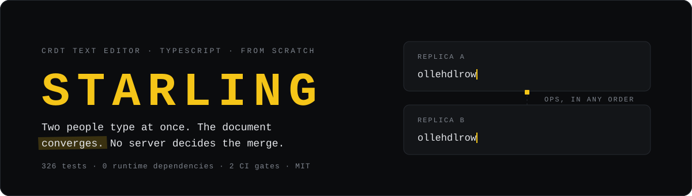
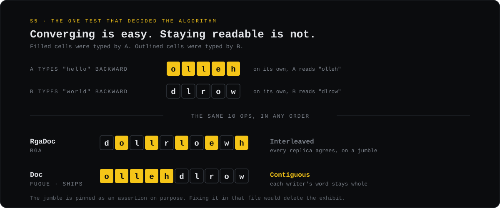
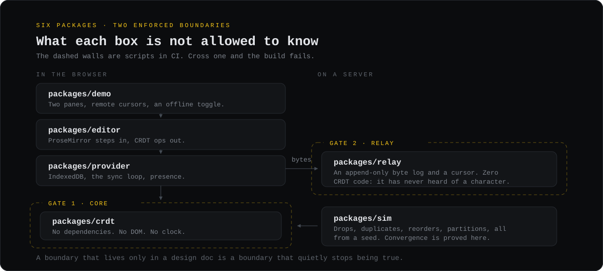
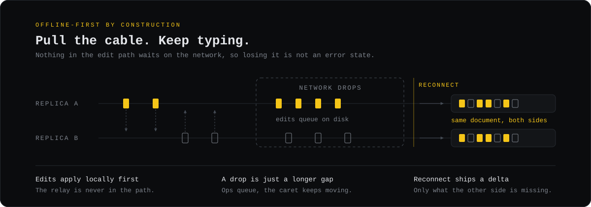
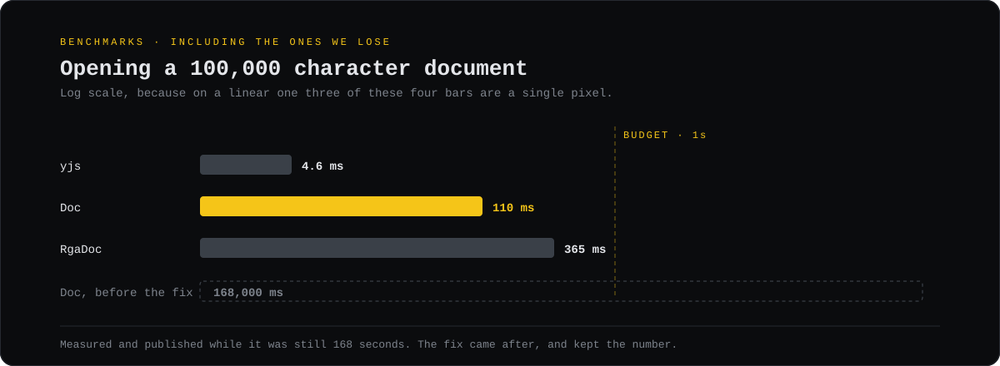

<div align="center">



<br/>

[](https://u7k4rs6.github.io/Starling/)


</div>

<br/>

## [Try the live demo →](https://u7k4rs6.github.io/Starling/)

Two panes, side by side, are two replicas of one document, and both are yours. Type in either and the text shows up in the other. That part proves nothing on its own: any shared textarea can echo keystrokes between two boxes. The demonstration is the break-it panel underneath. Cut a replica's link, or turn up latency, loss, and reordering, and keep typing on both sides. The two documents visibly **diverge**. Then restore the link, and they **converge** back to one document, with no conflict prompt, no "resolve changes" dialog, and nothing you typed lost on either side. That reconciliation, not the happy-path echo, is the entire reason this project exists.

A note in fairness: the relay is on a free tier that sleeps when idle, so the first Share of the day waits roughly a minute for it to wake. The editor stays fully usable the whole time, on a purely in-browser transport, and upgrades to the relay on its own once it is up.

<br/>

A collaborative text editor built on CRDTs, written from scratch in TypeScript. Several people edit one document at once, from different machines, some of them offline, and every copy ends up identical, with no server deciding who wins.

Most of what's interesting here is the stuff that usually gets swept under the rug: the version that silently corrupts your document while passing every test, the data structure that took 168 seconds to open a document, the merge rule that makes everyone agree on garbage. All three are still in the repo, each pinned by a test that reproduces its exact failure, and each is the reason the shipping version is built the way it is.

```ts
import { Doc } from "starling-crdt";

const a = new Doc("replica-a");
const b = new Doc("replica-b");

b.receive(a.insertLocal(0, "h"));
b.receive(a.insertLocal(1, "i"));

a.text; // "hi"
b.text; // "hi": same result whatever order the ops arrive in, dupes and drops included

// A cursor is a character id plus a side, never an integer offset.
const cursor = a.anchorAt(1);
a.insertLocal(0, "!");
a.resolveAnchor(cursor); // 2: it followed the character it was attached to
```

`npm install starling-crdt` for the core with no editor, relay, or browser attached. It has zero runtime dependencies.

<br/>

## Convergence isn't the hard part



Every CRDT in this repo converges. Getting replicas to agree is the easy half. The hard half is getting them to agree on the text a human actually typed.

Two people type a word each into the start of a line at the same moment, every keystroke landing to the left of the last. RGA lands on `dollrloewh`, both words shredded together a character at a time. Fugue lands on `ollehdlrow`, each word whole, one after the other. Identical inputs, identical convergence guarantee, and one of them is unusable.

That gap is the entire reason `Doc` (Fugue) ships and `RgaDoc` stays behind glass as a specimen. The jumble is asserted as a literal string in [`rga-doc.test.ts`](packages/crdt/src/rga-doc.test.ts), because deleting the bug would delete the evidence for why Fugue exists.

<br/>

## Architecture



| Package | What it does |
|---|---|
| [`crdt`](packages/crdt) | The algorithm, shipped as `starling-crdt`. `Doc` (Fugue) is the one you use; `RgaDoc`, `ArrayDoc`, and `NaiveDoc` are kept as reference implementations and benchmarked next to it. No dependencies, no DOM, no clock. |
| [`editor`](packages/editor) | The ProseMirror binding, plus an undo manager that uses no OT and no `prosemirror-history`. Headless: the whole thing runs in Node. |
| [`provider`](packages/provider) | Client glue: IndexedDB persistence, the relay transport, the sync loop, and presence (`AwarenessClient`, shipped and tested). |
| [`relay`](packages/relay) | An append-only byte log with a cursor. It has no idea what a character or a tombstone is. |
| [`demo`](packages/demo) | Two live replicas of one document, a panel that cuts, delays, drops, and reorders their links, and a convergence indicator. It leaves out the shipped `AwarenessClient` remote cursors on purpose, to keep one polling channel per pane and stay inside the free relay's request budget. |
| [`sim`](packages/sim) | A deterministic network: seeded RNG, virtual clock, a queue that drops, dupes, reorders, and partitions. The convergence proofs run against it. |

Two boundaries in that diagram are load-bearing enough to guard in CI. One keeps the core deterministic (no `Date.now`, no `Math.random`, no DOM, all injected) so the simulator can replay any bug from a seed. The other keeps the relay ignorant: it may not import the CRDT package or so much as mention `ElemId`. Both fail the build, not a linter warning, because a boundary that lives only in a design doc stops being true the first week nobody's looking.

<br/>

## Run it

```bash
pnpm install
pnpm test          # 328 property and unit tests
pnpm run gates     # the two boundary checks
```

The demo, two replicas in one page with a wire you can cut:

```bash
pnpm --filter @starling/demo run dev:relay   # terminal 1
pnpm --filter @starling/demo run dev         # terminal 2
```

Open it in two tabs and type into both. Full API in [`packages/crdt/README.md`](packages/crdt/README.md); benchmarks reproduce with `pnpm run bench`.

<br/>

## Offline



Edits hit the local document and IndexedDB before anything touches the network, so going offline isn't a failure to recover from; it's just a longer wait until the next sync. There's no outbound queue to reconcile. On reconnect, the two sides compare state vectors and ship only the ops the other is missing, never the whole log.

The whole thing (arbitrary delivery order, duplicates, drops, partitions that heal) is proved as a property against [`packages/sim`](packages/sim), seeded so any failure replays byte for byte.

<br/>

## Benchmarks



Cold-open, replaying a document's whole history, which happens every time anyone opens it, is the number that matters, and it's where the first cut fell apart: **168 seconds** at 100k characters, against a one-second budget. Every integration was walking the tree to the root to keep a size counter fresh, which is quadratic on a document typed front to back. Those counters are a cache nothing reads during replay, so they went lazy. Cold-open is **~110 ms** now.

| At 100k characters | Result |
|---|---|
| Cold-open | `Doc` ~110 ms · `RgaDoc` 365 ms · Yjs 4.6 ms |
| Wire size, forward typing | ~13.6 bytes/char, against Yjs at ~1.0 |
| Memory | ~610 bytes/char live, ~858 fully tombstoned |
| 60k deletions on the wire | 15 bytes |

Yjs is still faster on read and much tighter on the wire, and the local write path is still super-linear; the read fix didn't touch it. The method, the machine caveats, and every number that loses are in [`bench/README.md`](bench/README.md).

<br/>

## Four implementations, on purpose

"This data structure doesn't scale" carries more when the one that doesn't scale is sitting right there, still green, still benchmarked next to the winner.

| Class | Verdict | Kept to show |
|---|---|---|
| `NaiveDoc` | diverges | Two concurrent inserts at one index disagree. The mistake almost everyone makes first. |
| `ArrayDoc` | correct, unusable | A right merge over an array. O(n) per op, fine at every size you'd never actually reach. |
| `RgaDoc` | correct, interleaves | A treap makes it O(log n) and the fastest to open. It still shreds concurrent runs. |
| `Doc` | ships | Fugue. Fixes the shredding, meets the budget, loses on wire size. One `while` loop from `RgaDoc`. |

<br/>

## What the audit turned up

The build shipped with 289 tests. A correctness and security pass took it to 328 and found, among other things:

- **Placement by a bare counter** put a new joiner's text in the wrong spot, so everyone agreed on the wrong answer. Convergence had always held; intention hadn't. A Lamport clock in the id fixed it, and the suite had never been checking intention in the first place, which is why it slipped through 1,500 property runs.
- **Reload reused character ids.** Replaying a saved log restarted the id counter from zero, so the next edit collided with a live id and vanished.
- **The relay could hand back an evicted document as empty** and then desync on the next write.

`starling-crdt@0.1.0` is on npm with provenance. Cursors survive edits above them, undo is correct under concurrent remote edits, and the relay still contains zero lines that know what a CRDT is, all checked in CI. The full log, including the findings that were measured and deliberately left unfixed, is in [`docs/DECISIONS.md`](docs/DECISIONS.md).

<br/>

## Not in scope

Rich text past ProseMirror's basic schema, authentication, multi-document workspaces, mobile, operational transformation of any kind, and beating Yjs. The reasoning for each is in the [security doc](docs/03-SECURITY.md); the short version is that a link is the capability, the same trust model as a shared Google Doc.

<br/>

## Reading further

- [`docs/01-PRD.md`](docs/01-PRD.md): what it is and the success criteria it was held to
- [`docs/02-ARCHITECTURE.md`](docs/02-ARCHITECTURE.md): the algorithm, the wire format, the sync protocol
- [`docs/03-SECURITY.md`](docs/03-SECURITY.md): the trust model, and what's left out of it
- [`docs/04-FRONTEND.md`](docs/04-FRONTEND.md): the editor binding and the demo
- [`docs/DECISIONS.md`](docs/DECISIONS.md): every decision in order, reversals included
